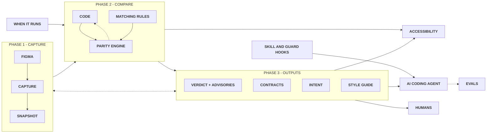

# rms-design-system-engine

The engine that maintains your design system.

It keeps designers, developers and the AI tools they use aligned on one design system. From your code and Figma it creates the style guide, the documentation and the contracts they all work from, then checks every change against them.

It keeps your code in parity with your design in Figma. It compares what was built (by a developer or by an AI) with what you designed: the colours, sizes, fonts, spacing, components and their states. When something is different, it tells you what, where, and how to fix it, in plain words. It also checks accessibility.

Have only Figma? It helps Claude build your design system in code from it, one piece at a time: it gives Claude the exact facts from Figma first (every token in every mode, the sizes, the variables, the role of each component) and checks each piece against Figma before Claude says it is done.

## Why use it

- **One system for everyone.** Designers, developers and AI tools work from the same style guide, documentation and contracts, made from your code and Figma, so the design system stays one system.
- **Catch differences early.** See when the code and Figma stop matching, before your users do.
- **Exact fixes, not vague notes.** Every difference comes with the file, the line and the right token to use.
- **Safer AI building.** When an AI builds screens, every change it makes is checked against your real components and tokens, and for accessibility, and it is told how to fix what does not match.
- **Accessibility included.** Text that is hard to read, buttons with no label, things you cannot reach with the keyboard.
- **The same answer every time.** The checks are fixed rules, not opinions.
- **You stay in control.** It never changes Figma, and it never changes your code unless you ask. An AI cannot accept a difference or switch a check off without asking you first.

## How it works

A short view of the flow. A more detailed flow can be seen on the [FigJam board](https://www.figma.com/board/W5UEjkrLv5t4fqsGPQWqk8/rms-design-system-engine-flow?node-id=0-1) (Ctrl or Cmd click to open it in a new tab).



## Get started

Two steps, both inside [Claude Code](https://claude.com/claude-code). You need [Node.js](https://nodejs.org) 22 or newer and Git on your computer.

**1. Install it, once per computer.** Paste this line in Claude Code and press Enter. The `!` at the start runs it for you.

```
! curl -fsSL https://raw.githubusercontent.com/rafaelmatosdasilva/rms-design-system-engine/main/install.sh | bash
```

Then close Claude Code and open it again, so it sees the new command.

**2. Connect your project, once per project.** Open your project in Claude Code and type this. It asks you for your Figma link.

```
/rms-design-system-engine set up this project
```

That's it. **It updates itself**: once a day it checks for a newer version and updates on its own, so you never install it again.

## Use it

The easiest way is to ask in Claude Code, in your own words, after `/rms-design-system-engine`. The terminal command does the same.

| You want to | Type in Claude Code | Or in the terminal |
|---|---|---|
| Check the whole design system | `/rms-design-system-engine check everything` | `rms-design-system-engine` |
| Check one component | `/rms-design-system-engine check the button` | `rms-design-system-engine --component button` |
| Check against Figma only, without accessibility | `/rms-design-system-engine check the button against Figma, without accessibility` | `rms-design-system-engine --only parity` |
| Check accessibility only | `/rms-design-system-engine check the accessibility of the button` | `rms-design-system-engine --only accessibility` |
| Run one check (a gate) | `/rms-design-system-engine run only the token values check` | `rms-design-system-engine --only 3` |
| Ask what the design system has | `/rms-design-system-engine which props does the badge take?` | `rms-design-system-engine --query badge` |

You can mix them. `rms-design-system-engine --component button --only accessibility` checks only the accessibility of the button.

### The style guide

`rms-design-system-engine --styleguide` builds a living style guide of what Figma and the code agree on, in `.design-system-engine-out/styleguide/index.html`. Every project fills the same template, the one in the engine (`templates/styleguide.template.html`), with its own data, so an improvement made there reaches every design system on its next run.

- **Foundations.** Colours, typography, spacing, radii and icons, each the CSS variable itself, shown only when the token check finds it equal to Figma in every mode.
- **Components.** Each one drawn from your own markup (the contract's probe, the first instance in your pages, or what its React source returns) with your own CSS. Its controls are the props both sides have, labelled with Figma's names; an option applies what your contract's propertyMap says it adds. Below it, the tokens behind what is drawn and its size.
- **Modes.** A switch for each of your mode collections, for the whole page or one component.
- **In use.** The approved pictures of your Figma frames (the ones the frame check compares against), when there are any.
- **Not agreed yet.** A prop only one side has, another default, a token that differs or a component not built yet is left out and counted in one line at the top, so you decide each one before it appears.

A project can still use a template of its own (`ds-config.json` → `styleguide.template`).

### Start from Figma only

Open an empty project, set it up with your Figma link, and ask for what to build. With no code yet, the engine starts in build mode: what Figma has and the code does not is listed as to build, in order, never as a failure.

| You want to | Type in Claude Code |
|---|---|
| Build the tokens | `/rms-design-system-engine build the tokens from Figma` |
| Build a component | `/rms-design-system-engine build the button from Figma` |
| Build a screen from the components | `/rms-design-system-engine build the settings screen from Figma with our components` |
| See what is left to build | `/rms-design-system-engine what is left to build?` |

Claude writes the code; the engine gives it Figma's exact names and values first and checks every piece after.

Measured on a small design system in Figma (tokens, four components and a screen), Claude with the Figma MCP alone built 8 of 18 pieces right with Opus, 16 of 30 with Sonnet and 4 of 18 with Haiku. With the engine all three built all of them. The [case study](CASE-STUDY.md) gathers every measurement in a few pages; the full log is in [test/skill-evals/RESULTS.md](test/skill-evals/RESULTS.md).

## Prototype with your design system

A prototype here is made only of your design system's own components, with their own options. Nothing is invented and nothing in the system changes. When a screen needs something the system does not have, the prototype shows a labelled box and you get a list of what the system would need, for your design team to decide.

Measured on six prototype requests, Claude alone made 13 of 18 right with Opus and 2 of 18 with Haiku; with the skill, 18 of 18 and 17 of 18 ([case study](CASE-STUDY.md)).

| You want to | Type in Claude Code | Or in the terminal |
|---|---|---|
| Make a prototype | `/rms-design-system-engine prototype a notification settings page with our components` | `rms-design-system-engine --prototype prototypes/settings.json` |
| See what a prototype may use | `/rms-design-system-engine what can a prototype use?` | `rms-design-system-engine --prototype --catalog` |
| Start from the screens you designed in Figma | `/rms-design-system-engine make prototypes from our Figma screens` | `rms-design-system-engine --prototype --from-screens <screen capture>` |
| Check that the product's pages match | `/rms-design-system-engine are our prototype pages consistent?` | `rms-design-system-engine --prototype --consistency` |

- **What a prototype is.** A short file listing which components go where, with which options (`prototypes/<name>.json`). The engine checks it first; one that uses a component or an option the system lacks is not drawn, and each line says why.
- **What you see.** One page with your real components and tokens, in light and dark, under `.design-system-engine-out/prototypes/`.
- **Everything the engine knows goes into it.** Before Claude writes a prototype it is shown what was read (Figma, the code, your recorded decisions, your guidelines from Notion, GitLab or the project, each with its age) and, for what you asked, the guidelines that apply, the components your words point to and the screen to start from. Each component comes with what it is for: Figma descriptions and annotations, option notes, code notes, when not to use it and what instead. A retired component is never used, a rule like "one button per screen" in your guidelines is held by the check, a component your documentation says never to use for something is not used for it, and after drawing each component is listed beside what the prototype uses it for, so a use your documentation rules out stands out.
- **Pages that match.** A new page is compared with the product's other pages: page padding, space between sections, screen width, heading style, where the actions sit, and the answer given to each need the system lacks. Each difference is listed with the pages it differs from. A screen your designers made counts on its own; your team can also write its decisions down in `prototypes/conventions.json`.
- **Layout.** Where your system has no layout components, the engine lends neutral ones (a page, a stack, a row, columns) that only take your spacing tokens and your text styles, and puts layout components on the list.
- **Your screens as starting points.** Each screen designed in Figma becomes a prototype with the same arrangement and your components in place. The capture is read from Figma and never changes it. What a screen uses that the system does not own (a local component, a container with its own look, a typed number) goes on the list too.
- **The list.** Every prototype's gaps are kept in `.design-system-engine-out/prototypes/gaps.json`, the most needed first.

You get a short summary back: what passes, what is different, and how to fix each thing. Nothing is changed until you ask for it.

## The checks

Each check is called a gate. To run just one, use its number or its name, for example `--only 3` or `--only "token values"`.

| # | Gate | What it looks at |
|---|---|---|
| 1 | Data is up to date | You are comparing with today's Figma, not an old copy |
| 2 | Figma frame unchanged | The design still looks like the version you approved |
| 3 | Token values match Figma | Colours, sizes and fonts, in every mode (light and dark) |
| 4 | Tokens used in screens exist | Nothing a screen uses is missing from the code |
| 5 | Every mode is covered | Things that should change between light and dark really do |
| 6 | Exception lists are valid | Your "ignore this" notes still point at real things |
| 7 | No invented CSS variables | Every variable in the code comes from a Figma token |
| 8 | Docs tell the truth | Your docs mention only things that exist |
| 9 | No invented text casing | No forced UPPERCASE the design did not ask for |
| 10 | No hand-built DS components | Screens use the real component, not a hand-made copy |
| 11 | Clean CSS | Nothing unused, nothing that contradicts Figma |
| 12 | Nested components keep their styles | One component's look does not leak into another |
| 13 | Structure matches | Heights, spacing and corners |
| 14 | All states are built | Hover, disabled, selected and the rest |
| 15 | Component props match Figma | The same names, defaults and choices |
| 16 | Sub-components match Figma | The parts inside a component are the right ones |
| 17 | Templates compose the right components | Each page is built from what Figma shows |
| 18 | Markup matches | Classes, icons and every control the design shows |
| 19 | Required pieces are in place | Icon slots, component slots and form fields |
| 20 | Icons match Figma | From the shared set, drawn the same way |
| 21 | Transitions match | Durations and easing |
| 22 | Motion matches | When your design defines it |
| 23 | Shadows match | When your design defines them |
| 24 | Renders correctly in a browser | Checked on the real page, not only the code |
| 25 | What this audit actually checked | So you can see that nothing slipped through |

Accessibility is checked beside the gates. Part of it reads the code directly, and when a page can be opened it also checks it in a real browser.

## Good to know

- **Share the results with your team.** Commit the files it creates in your project, so everyone, and your automated builds, check against the same design.
- **Figma stays as it is.** It only reads Figma. It tells you what to change there, and a person makes that change.
- **Reading Figma, the best way available.** `rms-design-system-engine --refresh-figma` picks it for you: a `design.json` newer than the saved data, then [figma-cli](https://github.com/silships/figma-cli) when Figma Desktop is connected to it (no API key, no rate limit, every mode), then the Figma tool of your Claude session, then the Figma API with a token. After you run `figma-cli snapshot`, the next check reads its `design.json` on its own; `--from-figma-cli` reads one directly.
- **More detail.** Everything for developers, every option and how each check works, is in [docs/details.md](docs/details.md).

## License

[MIT](LICENSE) © Rafael Matos da Silva. Free to use, change and share. Just keep the copyright line.
